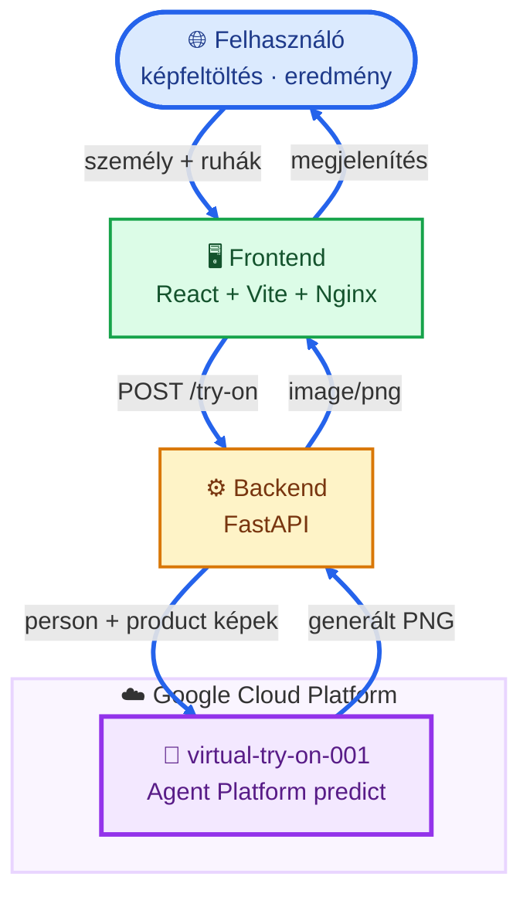
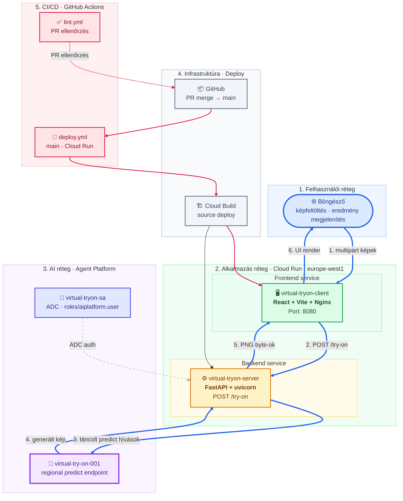
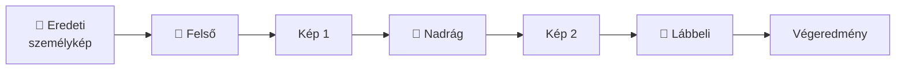
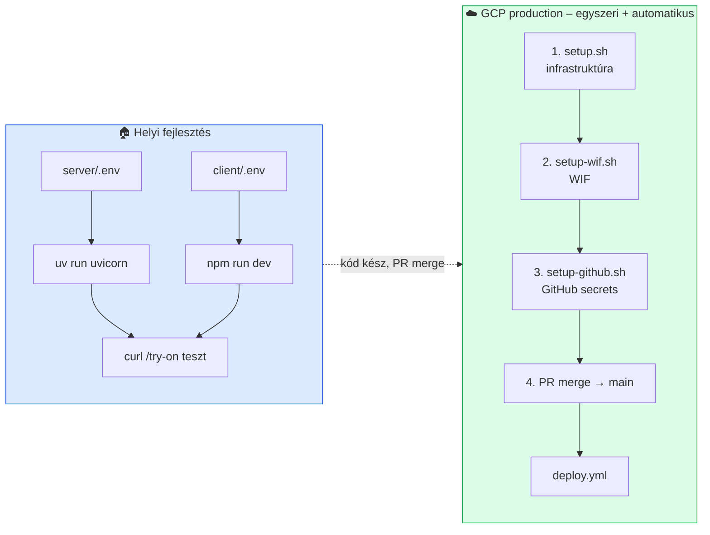

# Virtuális Próbafülke

Ruha felpróbálás AI-val: feltöltöd a saját fotódat és a ruhadarabokat (felső, nadrág, lábbeli), a rendszer pedig megmutatja, hogyan néznének ki rajtad. A generálást a Google Agent Platform `virtual-try-on-001` modellje végzi (Vertex AI Model Garden).

> **Megjegyzés:** A korábbi **Vertex AI** platformot Google a **Gemini Enterprise Agent Platform** néven egyesítette (Google Cloud Next ’26). A technikai API-k (`aiplatform.googleapis.com`) és IAM szerepkörök (`roles/aiplatform.user`) továbbra is ezt a nevet használják.

## Tartalom

1. [Gcloud telepítés](#1-gcloud-telepítés) – GCP production gyors út *(Cloud Run + CI/CD)*
2. [Általános ismerető](#2-általános-ismerető)
3. [Virtuális próbafülke skálázható felhő alapú megoldással](#3-virtuális-próbafülke-skálázható-felhő-alapú-megoldással)
   - [Architektúra](#architektúra)
   - [API végpontok](#api-végpontok)
   - [Előfeltételek](#előfeltételek)
   - [Telepítési áttekintés](#telepítési-áttekintés)
   - [**Helyi telepítés és tesztelés**](#helyi-telepítés-és-tesztelés) *(fejlesztői gép – backend + frontend)*
   - [GCP telepítés és tesztelés](#gcp-telepítés-és-tesztelés) *(részletes – scriptek, WIF, deploy)*
   - [Környezeti változók](#környezeti-változók)
   - [Működik-e?](#működik-e)
   - [Projekt struktúra](#projekt-struktúra)
4. [Képzési megjegyzés – „törött” állapot](#4-képzési-megjegyzés--törött-állapot)

---

## 1. Gcloud telepítés

Gyors útmutató a GCP-re való telepítéshez. Részletek alább a [GCP telepítés és tesztelés](#gcp-telepítés-és-tesztelés) szekcióban.

> **Csak helyben szeretnéd kipróbálni?** Ugorj a [Helyi telepítés és tesztelés](#helyi-telepítés-és-tesztelés) szekcióhoz – nem kell hozzá Cloud Run deploy, de GCP projekt és ADC bejelentkezés igen.

**Előfeltételek:** `gcloud` CLI, `gh` CLI, GCP projekt számlázással.

### 1. Környezeti változók beállítása

```bash
export GCP_PROJECT_ID=<a-gcp-projekt-id>
export GCP_REGION=europe-west1
export BACKEND_SERVICE=virtual-tryon-server
export FRONTEND_SERVICE=virtual-tryon-client
export GITHUB_REPO=<szervezet>/<repo-nev>
```

### 2. Bejelentkezés GCP-be

**Mindkét parancs kötelező** – a 3. lépés és a helyi backend csak ezután működik.

```bash
gcloud auth login
gcloud auth application-default login
```

- `gcloud auth login` – a `gcloud` CLI parancsokhoz (`config set project`, `setup.sh`, `setup-wif.sh`)
- `gcloud auth application-default login` – Application Default Credentials (ADC); nélküle a `set-quota-project` és a helyi backend `/try-on` hívás hibázik

### 3. Aktuális projekt beállítása

> Futtasd csak a 2. lépés **mindkét** bejelentkezése után.

```bash
gcloud config set project "${GCP_PROJECT_ID}"
gcloud auth application-default set-quota-project "${GCP_PROJECT_ID}"
```

- `gcloud config set project` – alapértelmezett projekt a gcloud CLI parancsokhoz
- `set-quota-project` – számlázási/kvóta projekt az ADC-hez (előfeltétel: `gcloud auth application-default login`)

### 4. Infrastruktúra telepítése

```bash
./scripts/setup.sh
```

A script kiírja a Cloud Run URL-eket.

### 5. Workload Identity Federation (WIF) – GitHub Actions hitelesítés

```bash
./scripts/setup-wif.sh
```

### 6. GitHub Secrets

```bash
gh auth login
./scripts/setup-github.sh
```

A script kilistázza a beállítandó secrets értékeket, majd kérdez: `Folytatod a beallitast? [y/N]` → nyomj **`y`**, Enter. (Automatikus folytatás: `./scripts/setup-github.sh --yes`.)

### 7. Alkalmazás deploy

Ha a forráskódban nincs módosítás, adj hozzá egy-egy üres sort ehhez:

- `server/src/virtual_tryon/main.py`
- `client/src/App.jsx`

1. GitHub repó → **Pull requests** → **New pull request** → **Create pull request**
2. **Merge** a PR-t a `main` branchre

A GitHub Actions automatikusan deployol – pár perc múlva él az alkalmazás. Követés: **Actions** → **Deploy**.

### 8. Tesztelés

1. Nyisd meg a frontend weboldalt a böngészőben. Az URL-t a `setup.sh` a végén kiírja, vagy a GCP Console → **Cloud Run** → `virtual-tryon-client` → **URL**.
2. Tölts fel egy személy fotót és legalább egy ruhadarabot a `test_images/` mappából (vagy saját képekkel), majd kattints a **„Próbáld fel!”** gombra.

### 9. Erőforrások törlése (demo újraindítás)

```bash
./scripts/teardown.sh
./scripts/teardown-wif.sh
./scripts/teardown-github.sh
```

A `teardown-github.sh` törli a GitHub secrets-eket és a pipeline workflow run history-t is.

---

## 2. Általános ismerető

Ez a projekt egy **skálázható felhő alapú virtuális próbafülke** demo: React frontend, FastAPI backend, Agent Platform API, Cloud Run deploy és GitHub Actions CI/CD.

| Komponens | Mit csinál? |
|-----------|-------------|
| **Frontend** (`client/`) | Képfeltöltés (személy + ruhadarabok), eredmény megjelenítés |
| **Backend** (`server/`) | Képek validálása, Agent Platform hívás, PNG visszaadása |
| **Agent Platform** | `virtual-try-on-001` modell – a személyre „ráhúzza” a ruhát |
| **Cloud Run** | Két független service: frontend (Nginx) és backend (FastAPI) |
| **GitHub Actions** | PR-en lint, `main` push után automatikus deploy |

### Hogyan működik? (3 lépés)

1. **Feltöltöd a képeket** – bal oldalra a saját fotód, jobb oldalra a ruhadarabok (felső, nadrág, lábbeli). Legalább egy ruhadarab kötelező.
2. **Az AI dolgozik** – a „Próbáld fel!” gombra kattintva a backend **láncoltan** küldi el a ruhadarabokat: minden körben az előző eredménykép lesz az új alap (pl. először felső, aztán nadrág, végül cipő).
3. **Megjelenik az eredmény** – a generált PNG kép teljes szélességben, alatta.

---

## 3. Virtuális próbafülke skálázható felhő alapú megoldással

Ez a repository **production-ready** megoldást ad: React frontend, FastAPI backend, Agent Platform API, Cloud Run deploy és GitHub Actions CI/CD.

A backend a `server/src/virtual_tryon/agent_platform.py` fájlban hívja a `virtual-try-on-001` modellt a regional predict endpointon keresztül. A modell neve a `MODEL_NAME` környezeti változóból jön (alapértelmezés: `virtual-try-on-001`).

### Architektúra

#### Magas szintű áttekintés



#### Részletes architektúra



#### Láncolt próbafülke logika

Ha több ruhadarabot töltesz fel (pl. felső + nadrág + cipő), a backend **egymás után** probálja fel őket:



Minden körben az előző eredmény lesz a „személykép” a következő ruhadarabhoz.

### Architektúra komponensek

| Komponens | Technológia | Felelősség | Miért külön? |
|-----------|-------------|------------|--------------|
| **Frontend** | React, Vite, Tailwind, Nginx | Képfeltöltés, betöltő, eredmény megjelenítés | Csak UI – nem tartalmaz AI hívást |
| **Backend** | FastAPI, uvicorn, `google-auth`, `requests` | Képek validálása, Agent Platform hívás, PNG válasz | Az AI integráció biztonságosan a szerveren fut |
| **Agent Platform** | `virtual-try-on-001` | Virtuális ruha felpróbálás | Managed AI – nem kell saját modellt futtatni |
| **Cloud Run** | Source deploy | Skálázható futtatás HTTPS-sel | Serverless – nincs szerver üzemeltetés |
| **Service Account** | `virtual-tryon-sa` | ADC auth, IAM jogosultságok | Az alkalmazás ne a fejlesztő személyes credjével fusson |
| **Cloud Build** | Source deploy | Forráskódból image építés deploy-kor | Egyszerű source deploy |
| **GitHub Actions** | `lint.yml`, `deploy.yml` | Lint PR-en, deploy `main`-en | Reprodukálható CI/CD |

### API végpontok

| Végpont | Metódus | Leírás |
|---------|---------|--------|
| `/try-on` | POST | Személykép + ruhadarabok (`multipart/form-data`) – válasz: `image/png` |

**Kérés mezők:**

| Mező | Típus | Kötelező | Leírás |
|------|-------|----------|--------|
| `person_image` | fájl | igen | Személy fotó (jpg/png, max 10 MB) |
| `product_images` | fájl(ok) | igen | Legalább egy ruhadarab (jpg/png, max 10 MB / fájl) |

**Hibakódok:**

| Kód | Jelentés |
|-----|----------|
| `400` | Érvénytelen fájltípus vagy túl nagy fájl |
| `500` | Agent Platform hiba vagy timeout (max 180 s) |

### Előfeltételek

| Eszköz | Miért kell? |
|--------|-------------|
| **Node.js** 22+ | Frontend futtatásához és buildhez |
| **uv** ([telepítés](https://docs.astral.sh/uv/)) | Backend függőségek kezelése |
| **gcloud CLI** | GCP infrastruktúra (`setup.sh`) és helyi ADC auth |
| **GCP projekt** | Agent Platform API (`aiplatform.googleapis.com`) + IAM |

### Telepítési áttekintés

| Környezet | Cél | Hogyan telepítünk? |
|-----------|-----|---------------------|
| **Helyi (fejlesztői gép)** | Gyors fejlesztés, hibakeresés | Kézzel: `uv` + `npm run dev` |
| **GCP (production)** | Valódi felhasználók, Cloud Run | Automatikusan: **GitHub Actions** (`deploy.yml`) |



#### Ki mit csinál?

| Lépés | Eszköz | Mit telepít? | Gyakoriság |
|-------|--------|--------------|------------|
| Infrastruktúra (API-k, SA, üres Cloud Run service) | `scripts/setup.sh` | GCP erőforrások – **nem** az alkalmazás kódját | Egyszer, projekt elején |
| Workload Identity Federation (WIF) | `scripts/setup-wif.sh` | Kulcs nélküli CI hitelesítés | Egyszer, `setup.sh` után |
| GitHub Secrets | `scripts/setup-github.sh` | Repository secrets (`gh` CLI) | Egyszer, `setup-wif.sh` után |
| Alkalmazás kód (server + client) | **GitHub Actions** `deploy.yml` | Forráskód → Cloud Run (source deploy) | Minden `main` push |
| Lint ellenőrzés | GitHub Actions `lint.yml` | Kódminőség PR-en | Minden pull request |
| Demo törlése (GCP) | `scripts/teardown.sh` → `teardown-wif.sh` | Cloud Run, runtime SA, WIF, CI/CD SA | Demo újraindításkor |
| Demo törlése (GitHub) | `scripts/teardown-github.sh` | Repository secrets, workflow run history | `teardown-wif.sh` után |
| Manuális `gcloud run deploy` | *(lásd lent)* | Ugyanaz, amit a CI is csinál | **Csak kivételes esetben** |

> **Fontos:** A Cloud Run-ra való telepítés **alapértelmezetten a GitHub Actions-szel történik**. A `setup.sh` csak az infrastruktúrát készíti elő.

### Helyi telepítés és tesztelés

#### Miért csináljuk?

- **Gyorsabb iteráció** – nincs Cloud Build várakozás, azonnali reload.
- **Olcsóbb** – fejlesztés közben nem fut Cloud Run.
- **Könnyebb hibakeresés** – logok a terminálban.
- **CI előtti ellenőrzés** – amit helyben lefuttatsz, azt a PR-en is lefuttatja a `lint.yml`.

#### Miért a backenddel kezdünk?

1. A **frontend a backend API-ra épül** – fejlesztésben a Vite proxy kezeli a `/try-on` útvonalat.
2. A **Agent Platform hívás** a backendben van – curl-lel önállóan is tesztelhető.
3. Ha a backend `/try-on` működik, a frontend már csak megjelenít.

#### 1. Backend

```bash
cd server
cp .env.example .env
```

Állítsd be a `.env` fájlban:

```env
GCP_PROJECT_ID=<a-gcp-projekt-id>
GOOGLE_CLOUD_LOCATION=europe-west1
ALLOWED_ORIGIN=http://localhost:5173
MODEL_NAME=virtual-try-on-001
```

```bash
gcloud auth login
gcloud auth application-default login
gcloud config set project <a-gcp-projekt-id>
gcloud auth application-default set-quota-project <a-gcp-projekt-id>
uv sync
uv run uvicorn virtual_tryon.main:app --host 0.0.0.0 --port 8000 --reload --env-file .env
```

**Try-on teszt (curl):**

```bash
curl -X POST http://localhost:8000/try-on \
  -F "person_image=@test_images/persons/person_1.jpg;type=image/jpeg" \
  -F "product_images=@test_images/garments/top_1.jpg;type=image/jpeg" \
  --output result.png
```

| Hiba | Ok |
|------|-----|
| `500 – virtual-try-on-001 error` | Nincs ADC, hiányzó IAM jogosultság, vagy hibás `GCP_PROJECT_ID` |
| `500 – timed out` | Több ruhadarab / lassú modell – max 180 s |
| `400 – Only jpg and png` | Rossz fájltípus |
| `403 / PERMISSION_DENIED` | Hiányzó `roles/aiplatform.user` a felhasználóra vagy SA-ra |

#### 2. Frontend

```bash
cd client
cp .env.example .env
npm install
npm run dev
```

Fejlesztésben a `VITE_API_URL` lehet üres – a Vite proxy továbbítja a `/try-on` kéréseket a `localhost:8000`-ra.

Nyisd meg: [http://localhost:5173](http://localhost:5173)

#### 3. Lint ellenőrzés

```bash
cd client && npm install && npm run build
```

### GCP telepítés és tesztelés

> **Gyors útmutató:** A lépések rövid összefoglalója az [1. Gcloud telepítés](#1-gcloud-telepítés) szekcióban.

#### Telepítési sorrend (ajánlott)

```
1. setup.sh          →  GCP infrastruktúra (egyszer)
2. setup-wif.sh      →  Workload Identity Federation (WIF) – GitHub Actions (egyszer)
3. setup-github.sh   →  GitHub Secrets (gh CLI)
4. PR merge main      →  alkalmazás deploy (automatikus, deploy.yml)
5. tesztelés         →  Cloud Run URL-eken
```

#### 1. Infrastruktúra – `setup.sh`

```bash
export GCP_PROJECT_ID=<a-gcp-projekt-id>
./scripts/setup.sh
```

#### 2. Workload Identity Federation (WIF)

```bash
export GCP_PROJECT_ID=<a-gcp-projekt-id>
export GITHUB_REPO=<szervezet>/<repo-nev>
./scripts/setup-wif.sh
```

| Service account | Szerep |
|-----------------|--------|
| `virtual-tryon-sa` | App futtatás, Agent Platform hívás |
| `virtual-tryon-cicd-sa` | Deploy GitHub Actions-ből (WIF) |

**Deploy hiba (`PERMISSION_DENIED`):** futtasd újra a `./scripts/setup-wif.sh`-t.

#### 3. GitHub Secrets – `setup-github.sh`

```bash
export GCP_PROJECT_ID=<a-gcp-projekt-id>
export GITHUB_REPO=<szervezet>/<repo-nev>
./scripts/setup-github.sh
# vagy megerősítés nélkül: ./scripts/setup-github.sh --yes
```

| Secret | Leírás |
|--------|--------|
| `GCP_PROJECT_ID` | GCP projekt azonosító |
| `GCP_WIF_PROVIDER` | WIF provider teljes resource neve |
| `GCP_WIF_SERVICE_ACCOUNT` | `virtual-tryon-cicd-sa@...` e-mail |

> A frontend deploy a backend URL-t deploy közben oldja fel (`deploy.yml`) – külön `VITE_API_URL` secret nem kell.

#### 4. Alkalmazás deploy – GitHub Actions

1. GitHub repó → **Pull requests** → **New pull request** → **Create pull request**
2. **Merge** a PR-t a `main` branchre

Követés: **Actions** → **Deploy**.

#### 5. GCP tesztelés

```bash
BACKEND_URL=$(gcloud run services describe virtual-tryon-server \
  --region europe-west1 --format='value(status.url)')

FRONTEND_URL=$(gcloud run services describe virtual-tryon-client \
  --region europe-west1 --format='value(status.url)')
echo "Nyisd meg: ${FRONTEND_URL}"
```

#### 6. Erőforrások törlése (demo újraindítás)

```bash
export GCP_PROJECT_ID=<a-gcp-projekt-id>
export GITHUB_REPO=<szervezet>/<repo-nev>
./scripts/teardown.sh
./scripts/teardown-wif.sh
./scripts/teardown-github.sh
```

<details>
<summary>Manuális deploy (fallback)</summary>

```bash
export GCP_PROJECT_ID=<a-gcp-projekt-id>
export GCP_REGION=europe-west1
CICD_SA=virtual-tryon-cicd-sa@${GCP_PROJECT_ID}.iam.gserviceaccount.com
RUNTIME_SA=virtual-tryon-sa@${GCP_PROJECT_ID}.iam.gserviceaccount.com

cd server
gcloud run deploy virtual-tryon-server \
  --source . --region "${GCP_REGION}" --allow-unauthenticated --quiet \
  --service-account "${RUNTIME_SA}" \
  --build-service-account "projects/${GCP_PROJECT_ID}/serviceAccounts/${CICD_SA}" \
  --set-env-vars="GCP_PROJECT_ID=${GCP_PROJECT_ID},GOOGLE_CLOUD_LOCATION=${GCP_REGION},MODEL_NAME=virtual-try-on-001"

BACKEND_URL=$(gcloud run services describe virtual-tryon-server \
  --region "${GCP_REGION}" --format='value(status.url)')

cd ../client
gcloud run deploy virtual-tryon-client \
  --source . --region "${GCP_REGION}" --allow-unauthenticated --quiet \
  --service-account "${RUNTIME_SA}" \
  --build-service-account "projects/${GCP_PROJECT_ID}/serviceAccounts/${CICD_SA}" \
  --set-build-env-vars="VITE_API_URL=${BACKEND_URL}"
```

A backend deploy után frissítsd az `ALLOWED_ORIGIN` értékét a frontend Cloud Run URL-jére:

```bash
FRONTEND_URL=$(gcloud run services describe virtual-tryon-client \
  --region "${GCP_REGION}" --format='value(status.url)')

gcloud run services update virtual-tryon-server \
  --region "${GCP_REGION}" \
  --update-env-vars="ALLOWED_ORIGIN=${FRONTEND_URL}"
```

</details>

### Környezeti változók

#### Server (`server/.env` vagy Cloud Run)

| Változó | Alapértelmezés | Jelentés |
|---------|----------------|----------|
| `GCP_PROJECT_ID` | – | GCP projekt azonosító (**kötelező**) |
| `GOOGLE_CLOUD_LOCATION` | `europe-west1` | GCP régió (predict endpoint) |
| `ALLOWED_ORIGIN` | `http://localhost:5173` | Frontend URL (CORS) |
| `MODEL_NAME` | `virtual-try-on-001` | Agent Platform modell neve |

#### Client (`client/.env` vagy build-time)

| Változó | Alapértelmezés | Jelentés |
|---------|----------------|----------|
| `VITE_API_URL` | _(üres)_ | Backend URL – fejlesztésben üres (proxy), produkcióban build időben kell |

> **Fontos:** A Vite környezeti változók **build időben** kerülnek be a frontend bundle-be. Cloud Run deploy-nál a `--set-build-env-vars="VITE_API_URL=..."` kapcsolót használd (lásd manuális deploy).

### Működik-e?

| Réteg | Állapot | Megjegyzés |
|-------|---------|------------|
| Frontend build | ✅ | Független a GCP-től |
| `/try-on` helyben | ⚠️ GCP kell | ADC + Agent Platform API |
| GCP deploy | ⚠️ CI-vel | `setup.sh` + `setup-wif.sh` + `setup-github.sh` + PR merge `main`-re |

### Projekt struktúra

```
trn-gcp-ai-virtual-tryon/
├── client/                          # Cloud Run #1 – React frontend
│   ├── src/
│   │   ├── components/
│   │   │   ├── ImageUploader.jsx    # Képfeltöltő
│   │   │   └── ResultDisplay.jsx    # Eredmény megjelenítő
│   │   ├── App.jsx                  # Fő komponens (3 ruhadarab slot)
│   │   └── main.jsx
│   ├── vite.config.js               # Dev proxy: /try-on → localhost:8000
│   ├── Dockerfile                   # Node build + Nginx
│   └── nginx.conf
│
├── server/                          # Cloud Run #2 – FastAPI backend
│   ├── src/virtual_tryon/
│   │   ├── config.py                # Környezeti változók
│   │   ├── main.py                  # POST /try-on endpoint
│   │   └── agent_platform.py        # Agent Platform predict hívás
│   ├── pyproject.toml               # uv függőségek
│   └── Dockerfile
│
├── scripts/                         # setup.sh, setup-wif.sh, setup-github.sh, teardown*.sh
├── .github/workflows/               # lint.yml, deploy.yml
├── test_images/                     # Demo képek (személy + ruhadarabok)
└── CLAUDE.md                        # Fejlesztési specifikáció
```

---

## 4. Képzési megjegyzés – „törött” állapot

Az alkalmazás alapállapotban **szándékosan nem működik teljesen** a képzésen: a `server/.env` fájlban a `GCP_PROJECT_ID` értéke üresen / placeholder – ezt a résztvevőkkel együtt töltjük ki. A modell neve (`virtual-try-on-001`) már be van állítva; a hiányzó projekt ID miatt a backend nem tud hitelesíteni a GCP felé, amíg nem konfigurálod.

**Mit csinál a résztvevő a képzésen?**

1. Beállítja a `GCP_PROJECT_ID`-t a `.env` fájlban (vagy Cloud Run környezeti változóként).
2. Lefuttatja az ADC bejelentkezést: `gcloud auth application-default login`.
3. Kipróbálja helyben vagy a deployolt Cloud Run URL-en.
